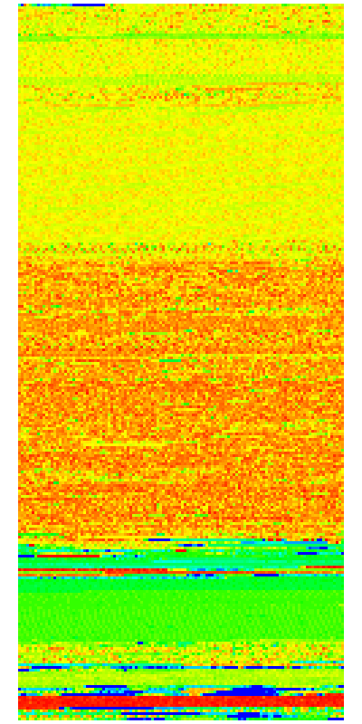

# Entropy Visualizer

Entropy Visualizer is a Python tool that analyzes any file by splitting it into blocks, computing the Shannon entropy for each block, and visualizing the results. Each block’s hexadecimal content is printed to the terminal with a background color that ranges from blue (low entropy) to red (high entropy). Additionally, the tool can generate an image where each block is represented as a colored square.

## Features

- **File Analysis**: Reads any file in binary mode.
- **Block Processing**: Splits the file into configurable blocks (default is 16 bytes per block).
- **Entropy Calculation**: Computes and normalizes the Shannon entropy for each block.
- **Color Mapping**: Maps entropy values to a gradient from blue (cold, low entropy) to red (hot, high entropy).
- **Image Output**: Optionally creates an image visualization of the file’s entropy distribution.
- **Terminal Visualization**: Uses ANSI escape codes to colorize the output in the terminal.

## Requirements

- **Python 3** is required.
- To generate image output, [Pillow](https://python-pillow.org/) is needed. Install it via pip:

```bash
  pip install Pillow
```

## Usage

Run the script from a command line terminal that supports **ANSI colors** with the required arguments.

**Usage example:**

```bash
  python3 EntropyVisualizer.py myfile.bin --block-size 8 --image entropy.png
```

- myfile.bin: The file to analyze. Can be any extension.
- --block-size 8: (Optional) Process the file in 8-byte blocks. The default is 16 bytes.
- --image entropy.png: (Optional) Save the output visualization as an image file.

If the image option is provided and Pillow is installed, the script will generate an image where each block is represented by a colored square arranged in a grid on a fixed 400×800 canvas.

## How It Works

    1. File Reading: The script opens and reads the specified file in binary mode.
    2. Block Splitting: The file content is divided into blocks of a specified size.
    3. Entropy Calculation: For each block, the Shannon entropy is computed, and then normalized against the maximum possible entropy.
    4. Color Mapping: The normalized entropy is mapped to an RGB color, creating a gradient from blue (low entropy) to red (high entropy).
    5. Terminal Output: Each block’s hexadecimal representation is printed with a background color corresponding to its entropy.
    6. Image Generation: If requested, an image is created where each block is drawn as a colored square.

## Output Example

Below is an example of the output image generated by Entropy Visualizer:


- **Terminal Output:**


- **Generated Image:**



## Contributing

Contributions, bug reports, and suggestions are welcome! Feel free to open an issue or submit a pull request.

## License

This project is licensed under the MIT License.